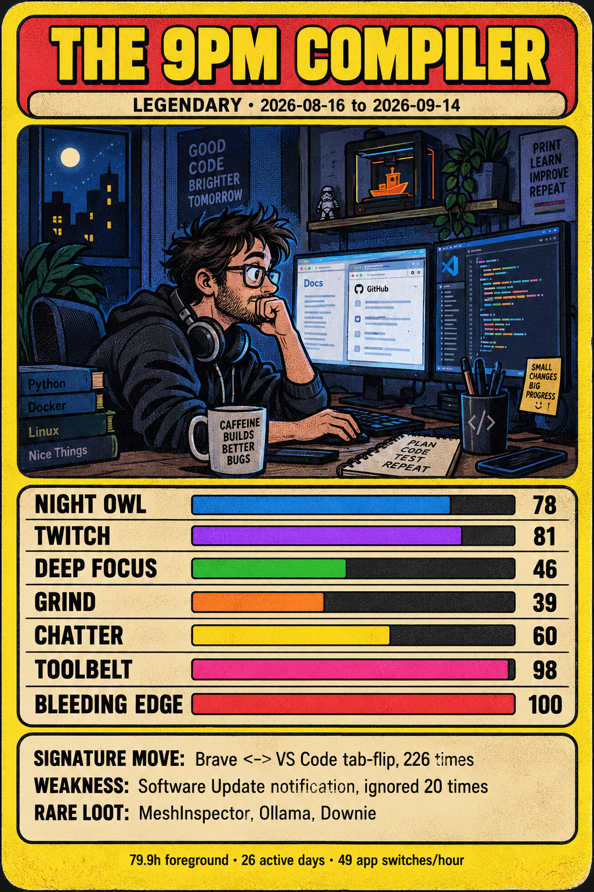

# Mac Top Trumps

Turn your Mac's app-usage log into a Top Trumps card.



macOS keeps about four weeks of "which app was in front, and when" in
`~/Library/Application Support/Knowledge/knowledgeC.db`. This script reads
it, scores you on seven stats, and prints a prompt you paste into ChatGPT
image generation to get the card.

## Use

1. Give your terminal app Full Disk Access
   (System Settings > Privacy & Security > Full Disk Access, add Terminal or iTerm, restart it).
2. Run:

   ```
   python3 mactrumps.py --name "THE 9PM COMPILER"
   ```

3. Paste the output into ChatGPT and ask for the image. For the closest
   match to the set, attach `sample-card.png` to the same message and add
   "match this card's style".

`--json` prints the raw numbers instead. Nothing leaves your machine except
what you paste.

## Stats (0 to 100)

| Stat | What it measures | 100 means |
|---|---|---|
| NIGHT OWL | share of screen time after 8pm | half your time is after 8pm |
| TWITCH | how short your typical app visit is | median visit under 1 second |
| DEEP FOCUS | longest unbroken stint in one app | 100 minutes |
| GRIND | hours per active day | 8 hours |
| CHATTER | share of time in messaging apps | 20% |
| TOOLBELT | distinct apps used | 50 apps |
| BLEEDING EDGE | beta macOS builds seen | 4 betas |

Same rubric on every Mac, so cards are comparable.

## Look and feel

The prompt carries a fixed style guide (border, banner, type, bar colours,
illustration style, layout order) so cards from different people look like
one set. Each stat always gets the same bar colour. Only the numbers, the
scene in the illustration and the border colour change. Border colour follows
rarity: navy for COMMON, red for RARE, yellow for LEGENDARY (any stat at 100).
The sample above is a real ChatGPT output from this prompt.

Requires macOS and Python 3 (preinstalled). No dependencies.
